<!--  -->

# 🐣 SK Networks Family AI & Encore 1st Mini Project 🐣

## About Project

### 💻 전국 자동차 등록 현황 및 기업 FAQ 조회시스템

이 프로젝트는 전국 자동차 등록 현황 및 기업 FAQ 조회시스템은 대한민국의 자동차 등록 데이터 제공 및 자동차 관련 기업들의 자주 묻는 질문에 대한 답변을 조회하는 플랫폼입니다.

## Team Information

Team Name : 머니 위버 (Money Weavers)

|  이름  	| 역 할 	| 세부 역할 	|     Github    	|
|:------:	|:-----:	|:---------:	|:------------- 	|
| 유혜린 	| 팀장  	| DB(MySQL) 	| @Lerini98     	|
| 구나연 	| 팀원  	| 웹 크롤링 	| @Gunayeon     	|
| 김성은 	| 팀원  	| 웹 크롤링 	| @cocoailjuice 	|
| 정재현 	| 팀원  	| 화면 구성 	| @Theeojeong     	|

## Project Subject

* MySQL

* Crawling

* Streanlit

## Flow Chart

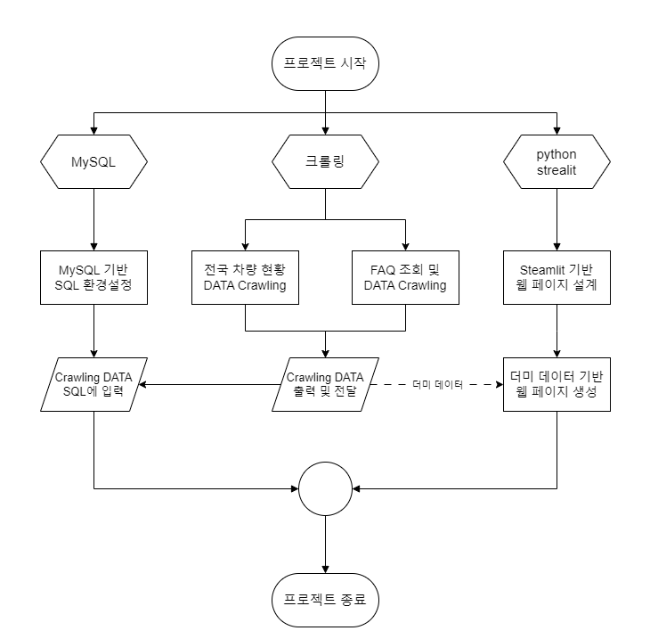

## Architecture

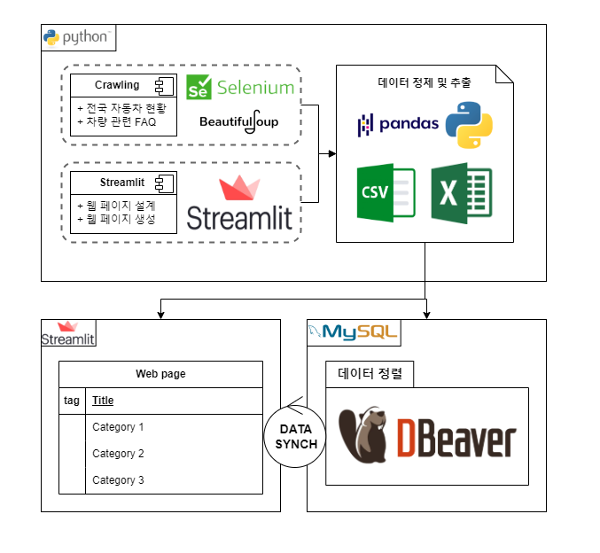

## ERD(Entity Relationship Diagram)

개체(Entity)와 개체 간의 관계(Relationship)를 시각적으로 표현

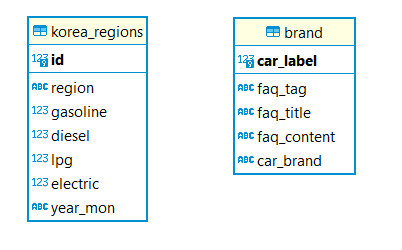

## Data Table
* **korea_regions**

    id : index(int)

    region : 대한민국 지역명(varchar(5))

    gasoline : 휘발유 차량 대수(int)

    diesel : 경유 차량 대수(int)

    lpg : LPG 차량 대수(int)

    electric : 전기차량 대수(int)

    year_mon : 년월 (varchar(50))

* **brand**

    car_label(PRIMARY KEY) : 현대 - 100번대 id, 기아 - 200번대 id(int)

    car_brand : 차 브랜드(varchar(10))

    faq_tag : 분류 (varchar(10))

    faq_title : Q&A 제목(varchar(100))

    faq_content : Q&A 내용(varchar(1000))

* **show tables~**

    * korean_region

        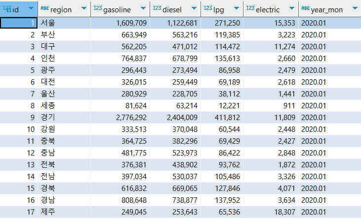

    * brand

        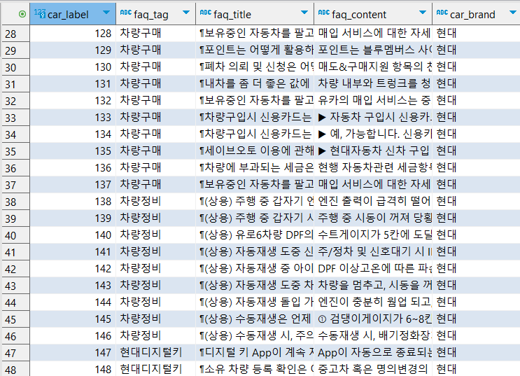

## 차량 브랜드별 웹 크롤링

* 웹 크롤링(Web Crawling)
     웹상의 정보를 탐색하고 수집하는 작업입니다.

    ex ) 시장연구, 경쟁사 분석, SNS트랜드 파악 등 다양한 분야에 활용 가능하며, 데이터를 수집하고 분석하여 의사결정에 활용하는데 이용합니다.
* **Purpose**

기업 별로 FAQ를 조회할 수 있는 시스템을 구현하기 위해 기업 홈페이지(현대, 기아)의 FAQ 부분을 Web Crawling 기술을 사용하였습니다. 크롤링은 홈페이지의 질문분류, 질문제목과 내용을 csv(Comma-Separated Variables) 파일로 추출하였습니다.

* **Process**

beautifulsoup과, selenium기술을 사용하여 웹페이지에서 질문들을 추출 진행 → 페이지의 질문들이 추출이 되지않는다는 Issue 발생

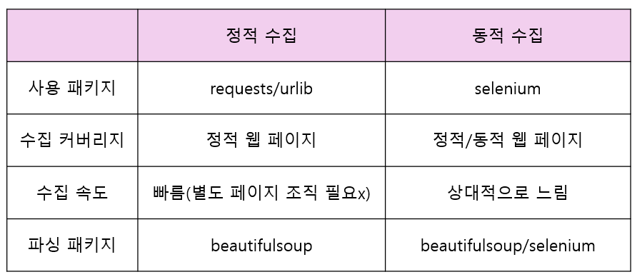

requests는 정적 웹 페이지만을 지원하여 생기는 Issue로 판단하였습니다. 따라서, 본 프로젝트의 크롤링 하려는 웹 페이지가 동적 웹을 고려하여 selenium을 채택하였습니다.

크롤링 에러 리포트
==================

### 1. 웹 드라이버로 사이트 켜진 뒤 바로 종료되는 이슈

*  해결방법

     <pre><code>driver.implicitly_wait(sec)</code></pre> 위의 코드에서 괄호 안의 숫자를 넉넉하게 준다.
     

### 2. 웹 드라이버에서 크롤링 명령어를 포함한 대부분의 명령어 실행 시 드라이버가 종료되는 이슈

* 해결방법

    <pre><code>time.sleep(sec)</code></pre>사이트 내의 로딩으로 인해 발생하는 이슈로 타임슬립을 주어 기다려주면 대부분 해결된다.    
     
    만일 해결되지 않는다면 크롤링 명령어를 수행하는 드라이버 창이 화면 밖에서 수행하기 때문이다.
     
     
    위의 해결 방법은 <pre><code>driver.execute_script("window.scrollTo(x, y)")</code></pre>위의 명령어를 이용하여 드라이버로 실행한 화면을 컨트롤해야 한다.
     

### 3. find_element 오류

* 해결방법

    By.XPATH를 이용하여 XPATH에 값을 지정하여 해결할 수 있다.
     
     
    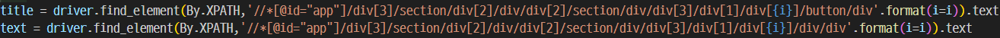
     
     
    또한, XPATH를 찾는 방법은 F12 - [Ctrl + Shift + C] - 객체 선택 - 선택한 구간에서 마우스 우클릭 - 복사 탭 - XPATH 복사로 가능하다.
    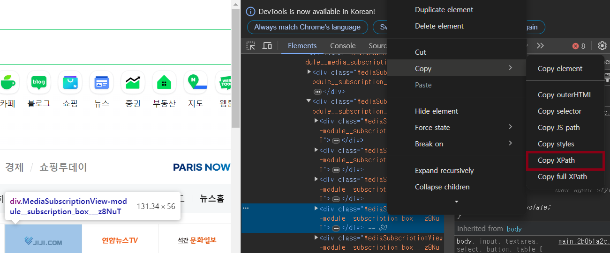
     

### 4. 2.의 파생 오류로 동적 웹 페이지 크롤링 시 element 선택 후 명령어 수행할 때 드라이버 오류

* 해결방법

    2.에서 언급한 해결방법과 동일하게 동적 페이지의 구동으로 인해 실행 명령어의 위치가 화면 밖으로 나가서 발생하므로 웹 페이지 화면의 이동이 필요하다.
     
     
    <pre><code>driver.execute_script("window.scrollTo(x, y)")</code></pre>따라서 위의 명령어를 이용하여 드라이버로 실행한 화면을 컨트롤해야 한다.
     

### 5. 반복문의 적용 시 발생하는 드라이버 오류

* 해결 방법

    명령어 실행 속도가 드라이버 또는 웹 페이지의 로딩 속도보다 빠르기 때문에 발생한다.
     
     
    <pre><code>time.sleep(sec)</code></pre>
    따라서 반복문의 실행 속도를 위의 명령어로 조절하면 된다.
     
     
     
     
     
     
     

판다스 에러 리포트
====================

### 1. 판다스로 to_csv로 저장한 파일이 깨지는 현상

* 해결 방법

    <pre><code>df.to_csv('./csvsource/hyundai/현대_차량구매_QnA.csv', index=False, encoding='utf-8')</code></pre>를 사용하면 파일에 저장된 한글이 깨지는 현상이 발생한다.
     
    이를 해결하기 위해선 아래의 코드로 대체하면 된다.
    <pre><code>df.to_csv('./csvsource/hyundai/현대_차량구매_QnA.csv', index=False, encoding='utf-8-sig')</code></pre>
     

병합 과정 중 발생한 오류
=========================

### 1. 패키지 내 병합 중 코드 인식 문제
* 해결 방법

    각각 실행하는 패키지에서 데이터 return의 인식 문제로 return 값이 불러오는 .py에서 적절한 위치에서 받는지 확인한다.
     

### 2. 패키지에서 전달하는 DataFrame 형태 인식 문제(미해결)
* 해결 방법

    DataFrame에서 불러오는 Data 형태를 일치시켜서 코드의 재작성이 필요하지만 시간 상 해결하지 못함.
     

## 화면 구성

* **메인페이지**

* **FAQ**
    * 현대

    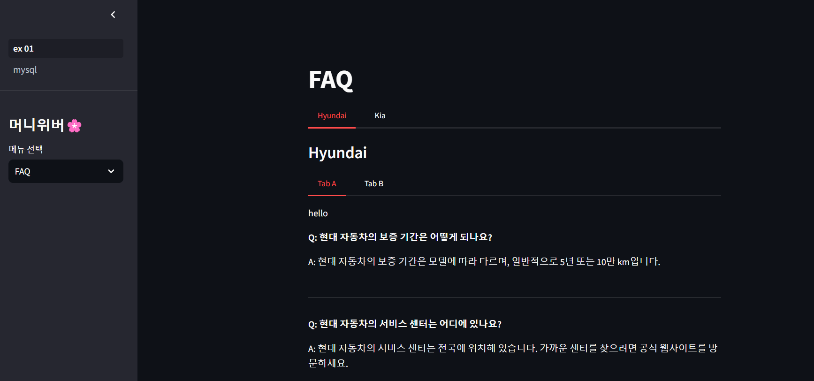

    * 기아

    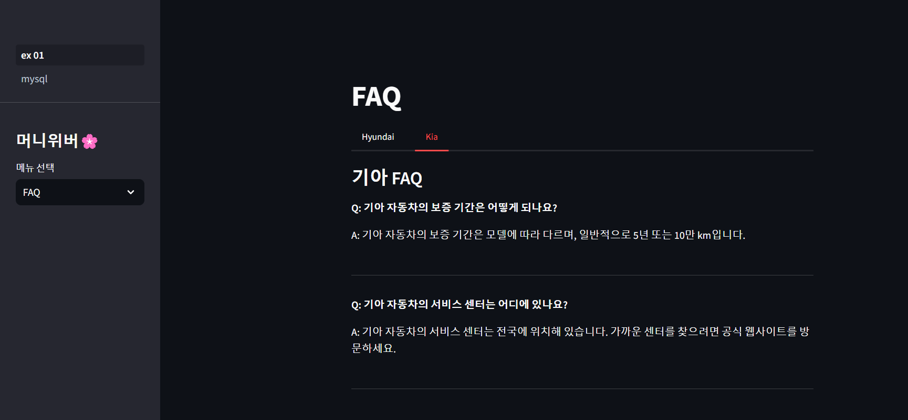

* **자동차 등록 현황 조회** 

    * 전국 자동차 분포 현황

    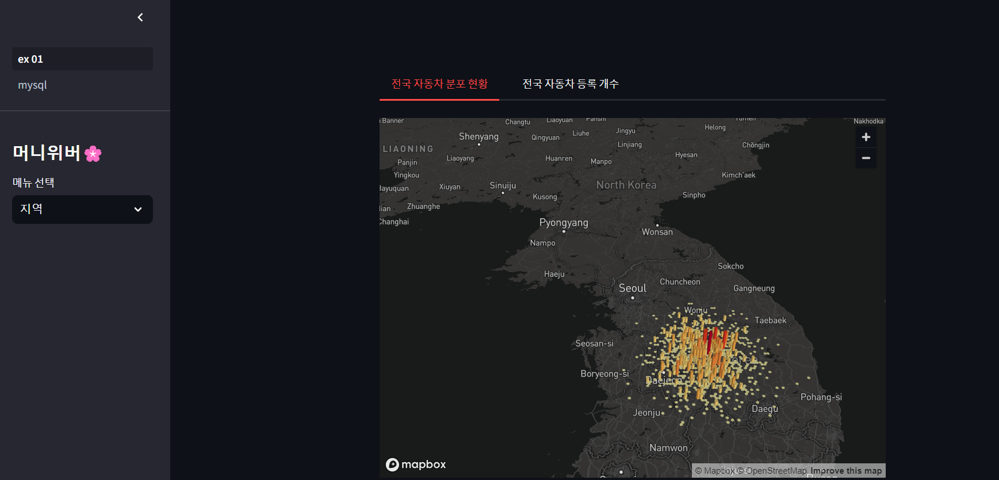

    * 전국 자동차 등록 개수

    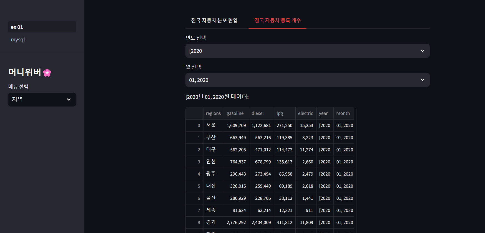

    * 지역별 차량 등록 현황(년월)

    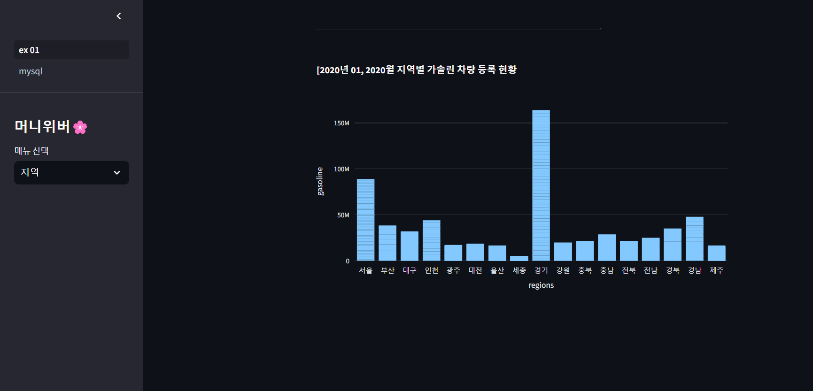

## 프로젝트 후기(한줄평)

유혜린 : 하루 너무 적어요.

구나연 : 제 부족한 점을 깨닫게 되었습니다.

김성은 : 실제로 코드를 생각해서 짜보니 많이 힘듭니다.

정재현 : 하루만 더 줬으면...

<!-- ## Folder Structure -->
